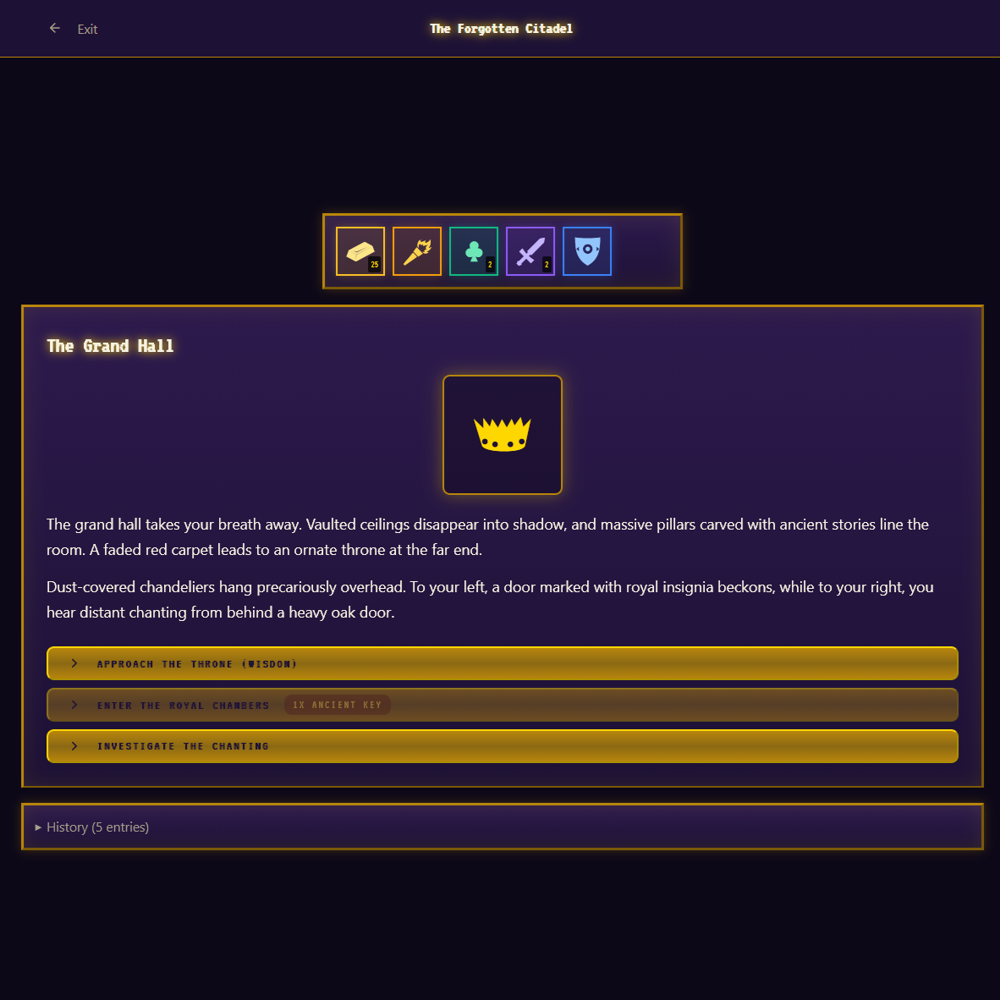
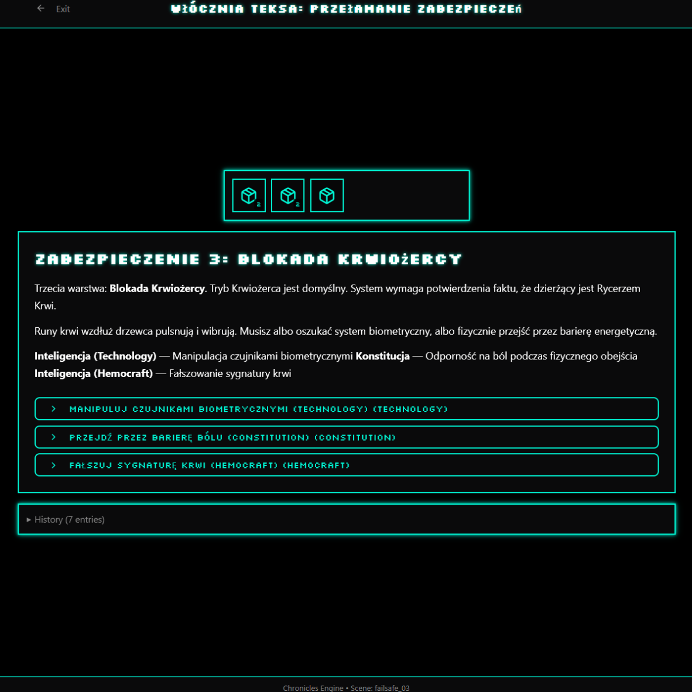
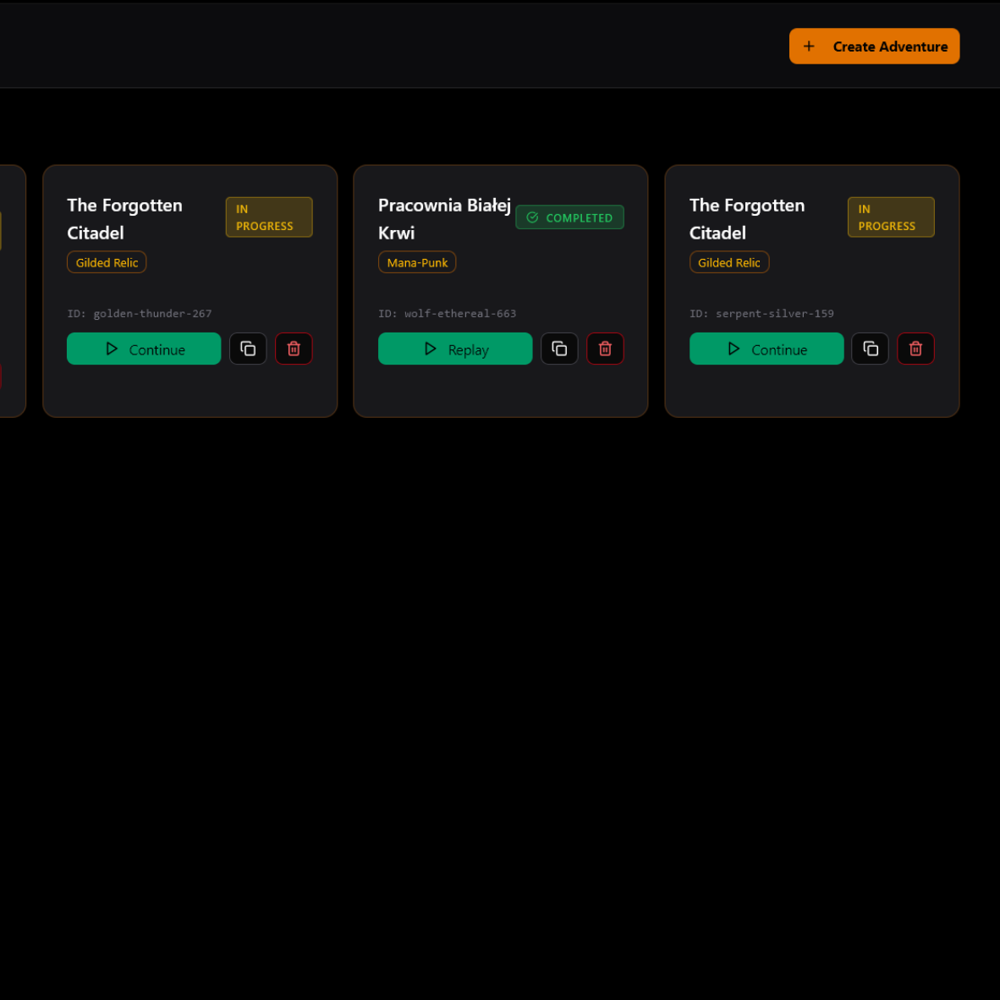
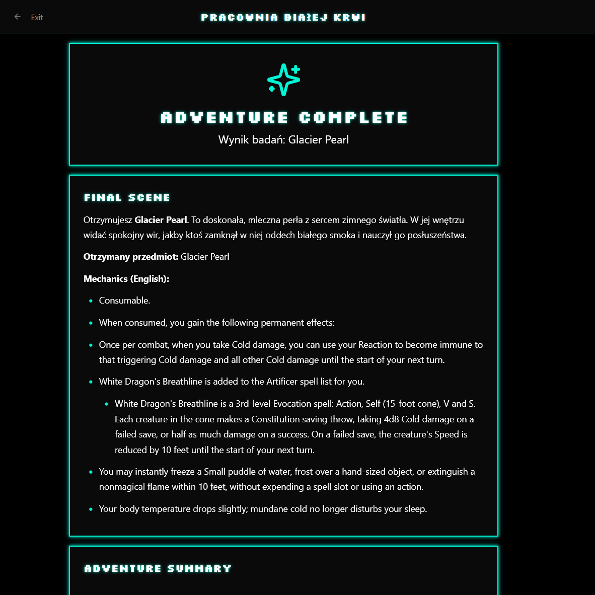
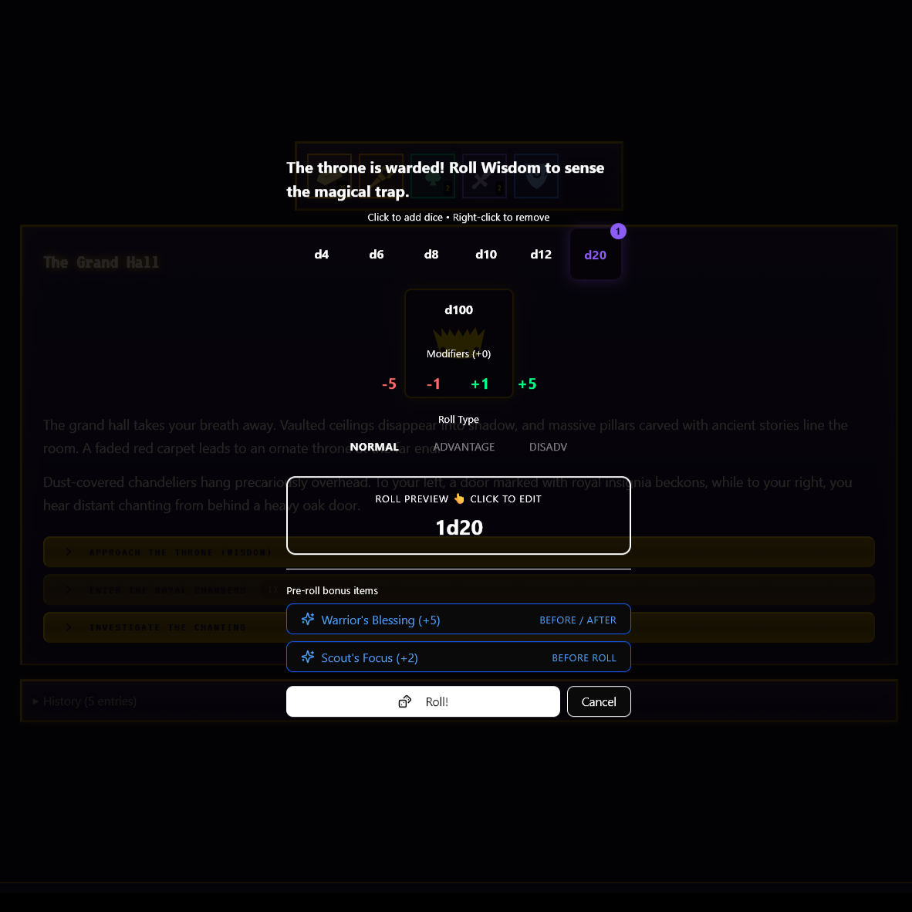

# Offsession

<p align="center">
  <strong>Short, stylish, YAML-driven DnD off-session adventures.</strong>
</p>

<p align="center">
  Give your players something meaningful to do between real sessions: compact text adventures, skill challenges, item rewards, and persistent consequences.
</p>

<p align="center">
  
  
  
  
  
</p>

## What this is

Offsession is a web app for running short DnD-style adventures outside the main table session.

The goal is simple:

- keep players engaged between meetings
- move personal side stories forward without eating live session time
- let the DM ship adventures fast from YAML instead of building bespoke UI every time
- preserve outcomes like items, history, completion state, and one-shot progress

An adventure can be authored as YAML, validated against the app API, published, and then played directly in the browser as a themed text adventure.

## What the app does

- Creates adventures from YAML with server-side validation
- Runs branching scene-based adventures with exits, skill gates, conditions, and effects
- Tracks inventory, counters, one-time choices, and session history
- Supports one-shot adventures that resume instead of spawning duplicate sessions
- Lets you protect adventures with admin and optional player passwords
- Ships multiple strong visual themes for different adventure moods
- Stores state in SQLite through Prisma
- Exposes clean API routes for creation, validation, and gameplay

## Why it works well for tabletop campaigns

Instead of asking players to "imagine what happened off-screen," Offsession gives them an actual playable artifact:

- a compact solo challenge
- a reward pipeline for items, currency, rerolls, or bonuses
- a record of what they did
- a presentable UI that feels like a game, not a form

That makes downtime feel authored, memorable, and cheap to produce.

## Screenshot Tour

<table>
  <tr>
    <td width="50%">
      
      <p><strong>Completion screen</strong><br/>Final reward, closing fiction, and mechanical payoff.</p>
    </td>
    <td width="50%">
      
      <p><strong>Gameplay</strong><br/>Scene text, inventory, gated choices, and themed presentation.</p>
    </td>
  </tr>
  <tr>
    <td width="50%">
      
      <p><strong>Adventure library</strong><br/>Create, continue, replay, clone, or delete adventures.</p>
    </td>
    <td width="50%">
      
      <p><strong>Completion screen</strong><br/>Final reward, closing fiction, and mechanical payoff.</p>
    </td>
  </tr>
  <tr>
    <td width="50%">
      
      <p><strong>Skill check preview</strong><br/>Branching challenge screens with clear stakes, roll setup, and outcomes.</p>
    </td>
  </tr>
</table>

## Adventure format

Offsession adventures are defined in YAML.

The current engine supports concepts such as:

- `meta` with title, description, theme, and `one_shot`
- `counters` for hidden logic state
- `inventory` for visible player resources
- `scenes` with text, icons, images, and exits
- gated exits with DCs and failure targets
- conditions like counter checks, item checks, and currency checks
- effects that mutate counters, items, and currency
- scene-level item gain and removal
- one-time exits and item requirements

Minimal example:

```yaml
meta:
  title: "The Forgotten Citadel"
  description: "An ancient ruin that keeps testing the reckless."
  theme: "gilded-relic"
  one_shot: true

inventory:
  torch:
    name: "Torch"
    description: "A reliable light source."
    type: "item"
    default: 1

scenes:
  - id: "start"
    title: "The Grand Hall"
    description: "Dust hangs in the air. A royal door waits ahead."
    exits:
      - text: "Enter the royal chambers"
        target: "royal_chambers"
        requires_item:
          id: "torch"

  - id: "royal_chambers"
    title: "The Inner Vault"
    description: "You step into the sealed heart of the citadel."
    exits: []
```

## Authoring with the agent skill

This repo is designed to pair well with the adventure authoring skill from the DnD Workshop repo:

- https://github.com/lectral/dnd-workshop/tree/main/.agents/skills/offsession-adventure-yaml

That skill knows how to:

- build adventures in the expected YAML format
- validate them against Offsession's API
- help iterate on structure and logic faster than manual trial and error

In practice, that means you can describe an idea in natural language, generate a structured adventure, validate it, and publish it into the app.

## API surfaces

Main routes exposed by the app:

- `POST /api/adventures` - create a new adventure from YAML
- `GET /api/adventures/[id]` - fetch public adventure metadata
- `DELETE /api/adventures/[id]` - delete an adventure
- `POST /api/adventures/validate` - validate YAML and graph structure
- `POST /api/game` - start a session

The validation endpoint returns structured errors, warnings, and graph information such as:

- reachable vs unreachable scenes
- terminal scenes
- dead ends
- whether the adventure is completable

## Stack

- Next.js 16
- React 19
- TypeScript
- Prisma + SQLite
- Tailwind CSS
- Docker + Docker Compose
- Optional Caddy reverse proxy

## Local development

Requirements:

- Node.js 22 recommended
- npm

Install and run:

```bash
npm ci
export DATABASE_URL="file:./db/offsession.db"
npm run db:generate
npm run db:push
npm run dev
```

Then open `http://localhost:3000`.

## Production / Docker

Build the image:

```bash
docker build -t offsession .
```

Run it directly:

```bash
docker run \
  -p 3000:3000 \
  -e DATABASE_URL="file:../db/custom.db" \
  -v "$(pwd)/db:/app/db" \
  offsession
```

Or use Compose:

```bash
OFFSESSION_IMAGE=offsession docker compose up -d
```

Optional environment variables:

- `DATABASE_URL` - SQLite database path used by Prisma
- `DISCORD_WEBHOOK` - send adventure lifecycle notifications

## Project shape

- `src/app` - Next.js app router UI and API routes
- `src/lib/adventure-utils.ts` - YAML schema parsing and validation logic
- `src/lib/game-state.ts` - gameplay state and history normalization
- `prisma/schema.prisma` - database schema
- `public/` - static assets and README screenshots

## Status

This is already a usable engine, not a mockup.

You can:

- define adventures in YAML
- validate them before publishing
- launch sessions in the browser
- persist progress
- finish with themed rewards and summaries

## If you want to build on it

Good next directions:

- richer DM tooling for reviewing finished runs
- import/export flows for adventure packs
- analytics for dead choices and failed gates
- party-level sync or shared off-session arcs
- AI-assisted adventure drafting directly inside the app
